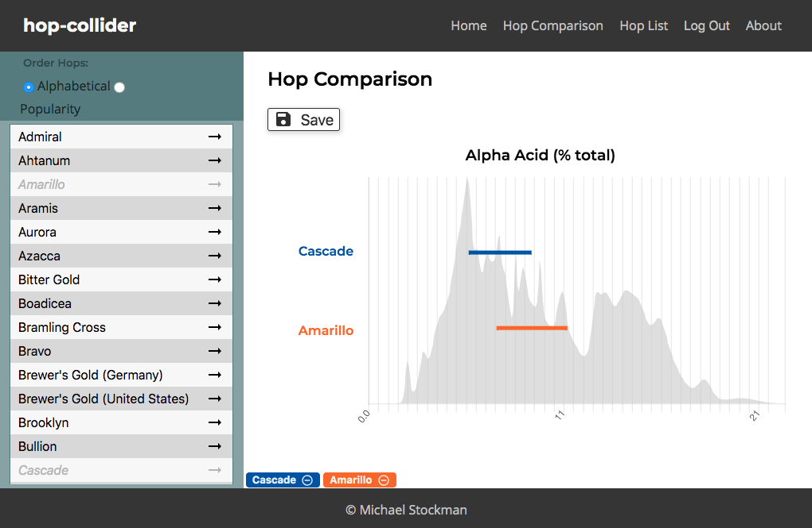

# Hop Collider
A data visualization tool to help brewers compare different varieties of hops. Users can select one or more hop varieties and plot the concentrations of flavor and aroma producing compounds against the distribution for all hop varities.

A deployed version can be found here: [hop-collider.herokuapp.com](https://hop-collider.herokuapp.com) 



## Utilized Web Stack
- `User Interface` - React, CSS, Chart.js
- `Client` - React, Redux, Redux-Saga
- `Server` - Node.js, Express
- `Database` - PostgreSQL

## Requirements
- Git
- Web browser
- Node and npm
- PostgreSQL

## Setup and Run
```bash
# 1. Create PostgreSQL database named 'hop_collider'
createdb hop_collider

# 2. Create table "Tasks" using SQL create statement in 'database.sql'. 
# (Optional: initalize database with sample data from 'database.sql')

# 3. Install Node dependencies/libraries using NPM
npm install

# 4. Start the server
npm run server

# 5. Start the client
npm run client

# 6. Application runs locally on PORT 3000
```

**See:** [localhost:3000](http://localhost:3000)

